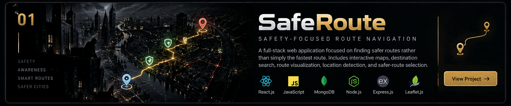
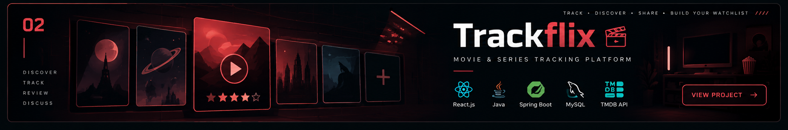

# MANOJ MITTAL

### Computer Science Student · Developer · Problem Solver

**DSA · Web Development · AI/ML**

---

> Building projects, solving problems, and learning one system at a time.

## Tech Stack

  

**Currently Exploring:** AI / ML

---

## Project Archive

 

## 

## DSA / Problem Solving

Currently building my problem-solving foundation with C++.

| Topic       | Status   |
| ----------- | -------- |
| Arrays      | Learning |
| Strings     | Learning |
| Recursion   | Learning |
| Stack       | Learning |
| Linked List | Learning |
| Queue       | Learning |

---
## LeetCode

  

**77+ Problems Solved · C++ · Daily Practice**

 

<a href="https://leetcode.com/u/Manoj_Mittal/">View LeetCode Profile →</a>

## [View LeetCode Profile →](https://leetcode.com/u/Manoj_Mittal/)

## Currently Working On

- Daily DSA problem solving in C++
- Improving and expanding my projects
- Building my foundations in AI/ML
- Exploring modern web development

---

## Collaboration

## Interested in building projects with other developers, contributing to open-source, and working on practical ideas.

## AI / ML

Currently building my foundations in Artificial Intelligence and Machine Learning.

- Machine Learning fundamentals
- Python for data and experimentation
- Model fundamentals
- AI concepts and problem solving

---

## Learning Roadmap

| Area                 | Focus                               |
| -------------------- | ----------------------------------- |
| DSA                  | Advanced problem solving            |
| Web Development      | Full-stack development              |
| AI / ML              | Projects and practical applications |
| Software Engineering | System design and clean code        |
| Open Source          | Collaboration and contributions     |

---

## GitHub Activity

## Connect

[GitHub](https://github.com/mamittal212-cmd) · [LeetCode](https://leetcode.com/u/Manoj_Mittal/)
